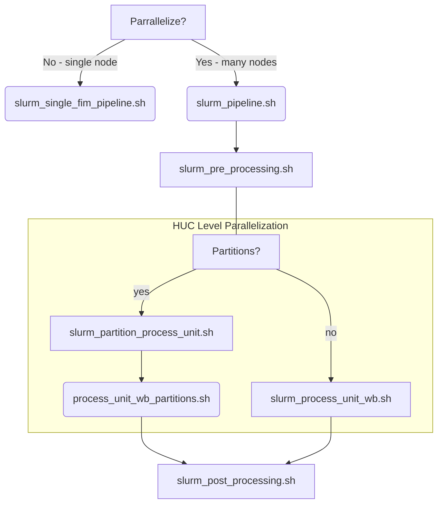

# FIM HAND Dataset Generation using Slurm on Parallel Works 
### Intro:

This directory contains the requisite scripts to use a slurm scheduler to generate HAND FIM Datasets using the existing scripts contained within the inundation-mapping repository. At the time of writting, these slurm scripts are configured to run on the Parallel Works Cloud HPC environment. Modifications will be necessary to extend these scripts to run on other HPC architectures.  The PW Cluster Definition must be configured in a very particular manner, otherwise the scripts will not work.

## Flow chart of slurm job script execution 



Please see the comments, as well as the child `slurm_*.sh` (sbatch) files to gain a better awareness of the procedues used before issuing a run.

## Prerequisite PW resources:

An PW 'Storage' provisioned and accessible. (eg: fimtest or fimefs AWS EFS)
    The 'Storage' is used for input data, and the output path - where the FIM HAND Data will be copied to after computations are completed. 

Ephemeral Storage (Optional):
    An AWS FSX for Lustre provisioned and accessible. (eg: fsx)
	
FSX can be set up as an ephemeral filesystem that may provide a faster platorm for the computations, but will not be used to persist the generated data. The FSX can be configured to mount an S3 Bucket if necessary. The S3 URI should match what was output as the bucket_name = “”, when provisioning the S3 bucket in the PW platform (not what is visible as the name in the PW UI.)

## PW Cluster Definition:
There are a few necessary requirements in the PW Cluster Definition for the slurm jobs to run smoothly.  

### Attached Filesystems

A Storage value of `fimopt` or `fimtest`, depending on AWS Account being used, with a Mount Point of `/efs`, is necessary to conform with the current version of the slurm scripts. 

(Optional) A FSX for Lustre Filesystem, with a Mount Point of `/fsx`.

### Partitions

The compute Partitions **must** be named following the paradigm: 
  - `compute<number>`. If only using one partition, it must be named `compute1`, if using more than one partition, increment each partition by one, eg. `compute2`, `compute3`, etc.
  - `pre-processing`
  - `post-processing`

### Advanced Settings
#### User Bootstrap
Within the User Bootstrap script, it is necessary to:
  1.  Configure the docker daemon
  2.  Pull the FIM docker image, making it available to all compute nodes for processing
  3.  Create the /fsx/outputs_temp directory if a FSX Filesystem is not Attached
  4.  Set a few key Slurm variables - if large domains will be run (BED or CONUS+ Domain)


**Please be advised that in using any of the scripts as is in this directory, you must have the inundation-mapping docker image available for use on all compute nodes. This is currently implemented as part of the Advanced Settings -> User Bootstrap portion of the PW cluster definition.**


## Start the Cluster:
Find your desired cluster under the HOME tab, and My Compute Resources.
Click the power button.
Please note that the power button is essentially a Terraform apply or Terraform destroy, depending on the state. For those not familiar with Terraform, that means the resource is provisioned and de-provisioned, so all files and folders not located in a mounted [persistent storage](#attached-filesystems) will not persist.

## Connecting to the Cluster Controller Node:

After the cluster has started, you can click the `<username>@<ip of cluster>` at top right which will open a terminal window on the PW webpage. 

You now have a Terminal window that is connected to the cluster.

From the Controller node, you can ensure that the mounts were successful:

```bash
ls /efs
df -h
```

Clone this version of the inundation-mapping repository. 
```bash
git clone https://github.com/NGWPC/inundation-mapping.git
git checkout incorporate-slurm (or branch containing slurm directory)
cd slurm/
```

## Multiple Node Concurrent HUC Level Processing using [`slurm_pipeline.sh`](slurm_pipeline.sh)

### Background
There are a couple of important considerations that need to be understood in order to effectively utilize this script. 

Depending on the quantity of HUCs in the huc list, it may be advised to use `slurm_single_fim_pipeline.sh`. This will run `fim_pipeline.sh` on only one compute node, which does not spread HUC level processing across different compute nodes. 

If your domain size (amount of hucs in the `huc_list.lst` file) is roughly above 5, using `slurm_pipeline.sh` is the preferred method. 

Calling `./slurm_pipeline.sh` is the easiest way to run the model and produce HAND FIM datasets for larger domains. It will call the necessary underlying slurm wrapper scripts (pre, process unit, post), and takes command line arguments directly. It can be run from the controller node, which allows one to skip the necessary [steps](#Connecting-to-a-Compute-Node-Interactively) if running interactively. 

The **optional** `-p` or `--partition` argument will divide the total amount of hucs in a huc list to process on different pre-defined slurm partitions. The total amount of hucs in a huclist is divided into "chunks", corresponding to each compute partition.
The use of partitions mitigates requesting a large amount of instances in one AWS Availability Zone.
Generally speaking, using the partition feature is not necessary if one does not require more than roughly 60 nodes (depending on the instance size being used).
You may set the Max Nodes to 60 in `compute1` the PW Cluster Definition, and avoid using the `-p` argument altogether for smaller runs, or if the time to solution is not critical.
Requesting more than 60 nodes in one partition is not realiable, and therefore not recommended.

A Slurm array job will be issued for the all hucs to manage and schedule processing. If using partitions, seperate slurm job arrays will correspond to each "chunk" of hucs.
The amount of concurrent array jobs (indices) to run at a time (`NUM_CONCURRENT_ARRAY_JOBS`) is defined by the Max Nodes defined in each `compute` partitions. This dynamically scales and optimizes the amount of concurrent processing based on the amount of nodes available on each partition. 
Some general rules:

The compute partitions' name in the PW Cluster definition should be 1 indexed. For example if using `-p 3`, your cluster definition should ideally have 4 partitions named `compute1`, `compute2`, `compute3` & `compute4`.
Why 4 partitions if using `-p 3`? This is because the amount of hucs in a huc list is typically not evenly divisible, so the additional partition (`compute4`) will execute the remainder of the hucs in the huc list. 
The `compute4`'s Max Nodes value (in PW Cluster definition) can be significantly smaller than the first three, due to the fact that only the remainder of hucs will be allocated to that partition.

**The integer provided to `-p` must be 2 or greater.**

`-p <n>` will divide the huc list into `<n>` 'chunks' for processing on each partition. 

### Error Handling

The [`check_arguments.sh`](check_arguments.sh) script is called for every invocation of `slurm_pipeline.sh`, and it designed to "fail fast" if there are any invalid arguments provided. This "fail fast" mechanism prevents nodes from issuing jobs if incorrect arguments are provided, ultimately making `slurm_pipeline.sh` more "user friendly" and preventing the need to debug via the slurm log files. The `set_huc_list` & `enforce_instance_type` functions have been added to [`bash_functions.env`](../src/bash_functions.env), and are called from `check_arguments.sh`. These two functions provide additional error handling and enforce the PW Cluster Definition supports the given configuration (HUC LEVEL & Resolution).  Approved instance size variables may need to be updated as needed (if more cost effective instances are identified, or as different HUC levels become supported).

### Execution

Here is an example (see the `usage` function and comments within each script for more options/information):

```bash
./slurm_pipeline.sh -u /data/inputs/huc_lists/dev_small_test_4.lst -n test_slurm_pipeline -jb 10 -s
```

Note the omission of the `-jh` argument. Each HUC is run as seperate array job. The `-jb` argument handles branch level parallelism.

### Logging 

The Slurm log files will be placed in `slurm/slurm_outputs/$run_name`. These directories are included in the `.gitignore` file, so there is no need to worry about accidentally pushing them to GitHub.

### Adding "approved" instance types
If a non-preconfigured PW cluster is desired to execute `slurm_pipeline.sh` (for example HUC6 at 20m resolution, using a larger instance size), this can be attempted, but a few changes are required in the source code, as error handling and cluster definition enforcement is in place. At a minimum, three partitions must exist, named `compute1`, `pre-processing`, and `post-processing` in the PW cluster definition.  Source code modifications would include: 

1. “Approve” the instance type defined in the `compute1` partition within the `enforce_instance_type` function in `src/bash_functions.env` (e.g.: `approved_huc6_instance_size_20m="r6a.48xlarge"`) 

2. Add an additional case block in `enforce_instance_type`'s `case` statement (e.g.: `20_6)` ) which returns an exit code of zero (e.g.: `return 0`). 

## Viewing and troubleshooting slurm jobs

`slurm_pipeline.sh` will print the output of a `squeue` command before `slurm_post_processing.sh` is submitted. This is a snapshot in time. You may issue the `squeue` command again to track the the state of slurm jobs. 

```bash
squeue --format="%.22i %.20P %.30j %.20T %.10M %.9l %.6D %R"
```

The `sinfo` command gives the status of nodes, and can be useful.

Occasionally, slurm jobs may stall or hang in a `COMPLETING (CG)` state. If this is one of the array jobs issued from `slurm_process_unit*.sh`, it may stall the execution of `slurm_post_processing.sh`, since all array jobs need to finsh before post processing is submitted. 
See the logs in slurm/slurm_outputs to verify the processing has indeed completed before trying to cancel the job. 

```bash
scancel <job_id>
```

```bash
scancel --signal=KILL <job_id>
```

For more information on Slurm, please see the [documentation](https://slurm.schedmd.com/documentation.html).

## Single Node Processing 

### Using slurm from the controller node

`slurm_single_fim_pipeline.sh` should be used to issue smaller domain runs **on one compute node**. It is advised to review the arguments to [`fim_pipeline.sh`](../fim_pipeline.sh). There are many command line arguments ( `-o`, `-r`, `-sc`, `-s`) that can be added to the `./foss_fim/fim_pipeline.sh` command within `slurm_single_fim_pipeline.sh` script if desired. `slurm_single_fim_pipeline.sh` can be modified, and is provided as an example. 


### Connecting to a Compute Node Interactively:
#### Use these steps to issue Docker run command interactively and direcly call `fim_pipeline.sh`

In the case of running fim_pipeline.sh interactively on one Compute Node, we need to allocate a Compute Node and issue the script (after logged into a docker container) that will generate the FIM datasets.

Allocate an interactive compute node
```
salloc --cpus-per-task=1
```

Get JOB ID
```
squeque
```

Collect the Job Id from squeue output (replace <JOB_ID> below) & connect to compute node
```
srun --pty --jobid <JOB_ID> /bin/bash
```

Ensure your command prompt has changed to the compute node.

From there, you can modify the docker run command to mount different filepaths as necessary.

Once within the docker container, you may execute the `fim_pipeline.sh` command to suit your requirements. 
